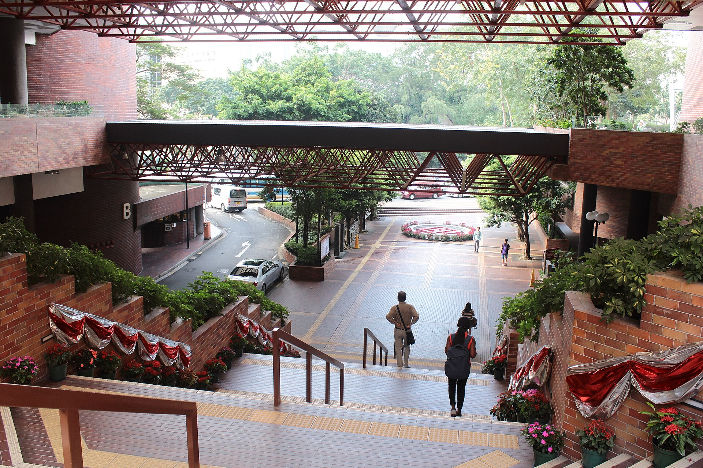
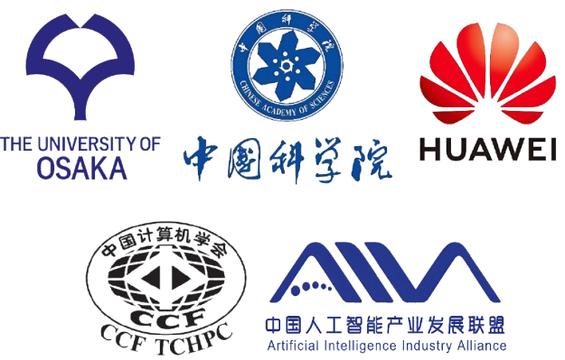
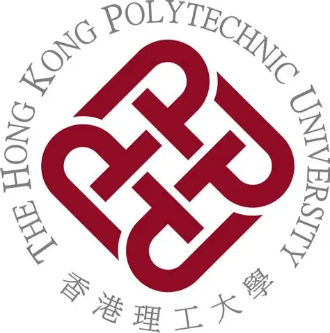

  <figure class="destination-hero">
    
  </figure>
  <figure>
    
  </figure>
  <figure>
    
  </figure>

# Overview

CODESIGN 2026, the International Workshop on CODESIGN, will be held from October 21 to 23, 2026 at The Hong Kong Polytechnic University in Hong Kong, China. The workshop is organized by the China Computer Federation (CCF), hosted by the CCF Technical Committee on High Performance Computing (CCF TCHPC), and co-organized by the Institute of Computing Technology, Chinese Academy of Sciences (ICT, CAS) and The Hong Kong Polytechnic University. Ninghui Sun, Academician of the Chinese Academy of Engineering, and Jiannong Cao, Vice President of The Hong Kong Polytechnic University, serve as the General Chairs. On behalf of the organizing committee, we warmly invite colleagues from around the world to join&nbsp;us&nbsp;in&nbsp;Hong&nbsp;Kong.

Since its inception, CODESIGN has developed into an internationally recognized forum for breaking down disciplinary boundaries among hardware design, system software, algorithms, and scientific applications. It brings together hardware architects, system software developers, applied mathematicians, and computational scientists to pursue deep, sustained collaboration. As computing systems become increasingly complex and the benefits of isolated optimization diminish, cross-layer co-design has become one of the most dependable paths to higher performance, greater efficiency, and continued scientific progress.

Recent developments reinforce this trend. Launched in late 2025 and moved into implementation in 2026, the U.S. Genesis Mission is building an integrated platform that brings together supercomputers, AI systems, emerging quantum technologies, scientific instruments, datasets, and models. In July 2026, the U.S. Department of Energy selected more than 200 initial research projects to develop and demonstrate AI-enabled scientific workflows. This initiative reflects a clear shift: advanced computing platforms are becoming foundational infrastructure for scientific discovery rather than merely supporting tools. Their ability to enable major breakthroughs depends on deep coordination across architecture, system software, algorithms, data, and scientific applications.

Co-design is therefore no longer only a means of extracting more performance from a system; it is increasingly central to defining the form and capability of next-generation research infrastructure. At the same time, quantum computing and other emerging technologies are moving toward practical scientific use. Quantum–HPC convergence opens new paths for problems beyond the reach of conventional architectures, while raising new questions: how to orchestrate heterogeneous quantum and classical resources within a unified system stack, how to design cross-scale programming models and runtimes, and how to build data and communication infrastructure for hybrid workloads.

CODESIGN 2026 will focus on four themes: algorithm–software co-design, architecture–system co-design, application-driven co-design and AI for Science, and co-design for emerging computing. Two roundtable discussions will examine the shape of next-generation supercomputers and cross-layer abstractions in the AI era. As an international center for research and academic exchange, Hong Kong provides an important bridge for colleagues from different regions to meet, exchange ideas, and help shape the future of computing together.

# Workshop Information

- **Venue:** The Hong Kong Polytechnic University
- **Address:** 11 Yuk Choi Road, Hung Hom, Kowloon, Hong Kong SAR, China
- **Dates:** October 21, 2026 (Arrival and Registration) – October 23, 2026 (Departure), 3 days

# Topics of Interest

The technical program is organized around four primary directions:

- **Algorithm–Software Co-Design**
  - Cross-layer design of numerical and learning algorithms, programming models, compilers, libraries, runtimes, and system software
  - Communication-avoiding and data-intensive algorithms for large-scale systems
  - Performance portability, automated tuning, energy efficiency, resilience, accuracy, and scalability

- **Architecture–System Co-Design**
  - Co-design of processors, accelerators, memory hierarchies, storage systems, interconnects, and networks
  - Runtime systems, scheduling, and resource management for heterogeneous supercomputers and AI computing platforms
  - Reliability, security, energy efficiency, data movement, and system-level performance optimization

- **Application-Driven Co-Design and AI for Science**
  - Co-design guided by requirements from life sciences, earth and environmental sciences, materials, chemistry, physics, engineering, and other scientific domains
  - Scientific foundation models, AI-enhanced simulation, autonomous experimentation, and intelligent scientific workflows
  - Integration of computing platforms, scientific instruments, data, and models, with an emphasis on verification and reproducibility

- **Co-Design for Emerging Computing**
  - Quantum–HPC integration and coordinated execution across quantum and classical resources
  - Hybrid programming models, compilers, runtimes, scheduling, and resource orchestration
  - Data and communication infrastructure for hybrid workloads and emerging domain-specific computing systems

# Workshop Program
### 2026.10.21
* 09:00–13:30 — Arrival in Hong Kong & Registration
* 13:30–13:50 — Opening Session
* 13:50–15:20 — Keynote Session
* 15:20–15:45 — Group Photo & Coffee Break
* 15:45–17:05 — Session I
* 18:00–20:30 — Welcome Dinner

### 2026.10.22
* 07:00–08:30 — Breakfast
* 09:00–10:40 — Session II-A
* 10:40–11:05 — Coffee Break
* 11:05–12:25 — Session II-B
* 12:25–13:45 — Lunch
* 13:45–15:25 — Session III
* 15:25–15:50 — Coffee Break
* 15:50–16:50 — Panel Discussion 1
* 16:50–17:30 — Tour of The Hong Kong Polytechnic University
* 18:00–20:30 — Dinner

### 2026.10.23
* 07:00–08:30 — Breakfast
* 09:00–10:00 — Session IV
* 10:00–10:20 — Coffee Break
* 10:20–11:20 — Panel Discussion 2
* 11:20–11:40 — Closing Session
* 11:40–13:00 — Lunch
* From 13:00 — Leaving Workshop

# Organization Committee

### General Chairs
* Ninghui Sun, _Academician of the Chinese Academy of Engineering; Professor, Institute of Computing Technology, Chinese Academy of Sciences; Dean, School of Computer Science and Technology, University of Chinese Academy of Sciences, China_
* Jiannong Cao, _Vice President, The Hong Kong Polytechnic University; Otto Poon Charitable Foundation Professor in Data Science; Chair Professor of Distributed and Mobile Computing, Department of Computing, Hong Kong, China_

### Program Chairs
* Dingwen Tao, _Professor, Institute of Computing Technology, Chinese Academy of Sciences, China_
* Amelie Chi Zhou, _Assistant Professor, Hong Kong Baptist University, Hong Kong, China_
* Zhaorui Zhang, _Assistant Professor, The Hong Kong Polytechnic University, Hong Kong, China_

### Opening Remarks
* Jiannong Cao, _Vice President, The Hong Kong Polytechnic University, Hong Kong, China_
* Guangming Tan, _Secretary-General, Technical Committee on High Performance Computing, China Computer Federation; Professor, Institute of Computing Technology, Chinese Academy of Sciences, China_

### Registration Chair
* Wenjing Huang, _Chinese Academy of Sciences, China_
* Yida Gu, _Chinese Academy of Sciences, China_

### Web Chair
* Bing Lu, _Chinese Academy of Sciences, China_

# Sponsor

<svg aria-hidden="true" width="0" height="0" style="position: absolute; overflow: hidden;">
  <filter id="sponsor-white-to-alpha" color-interpolation-filters="sRGB">
    <feColorMatrix type="matrix" values="1 0 0 0 0  0 1 0 0 0  0 0 1 0 0  -1 -1 -1 3 0"/>
  </filter>
</svg>

  

  

  

  

  

  

